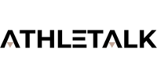
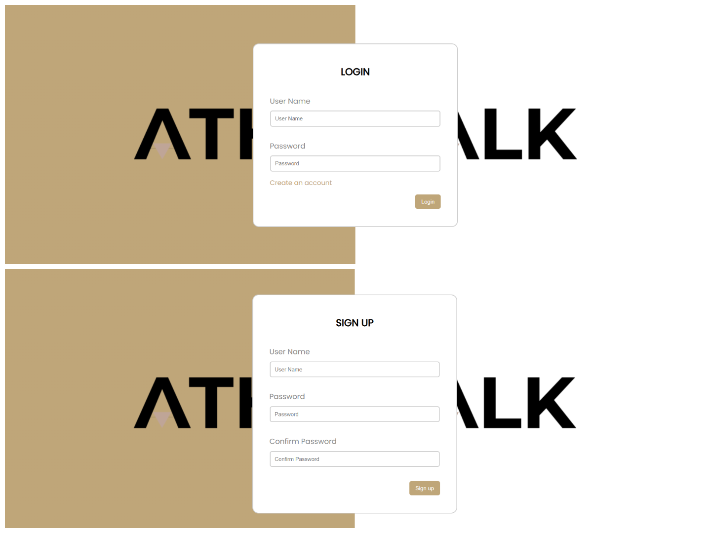
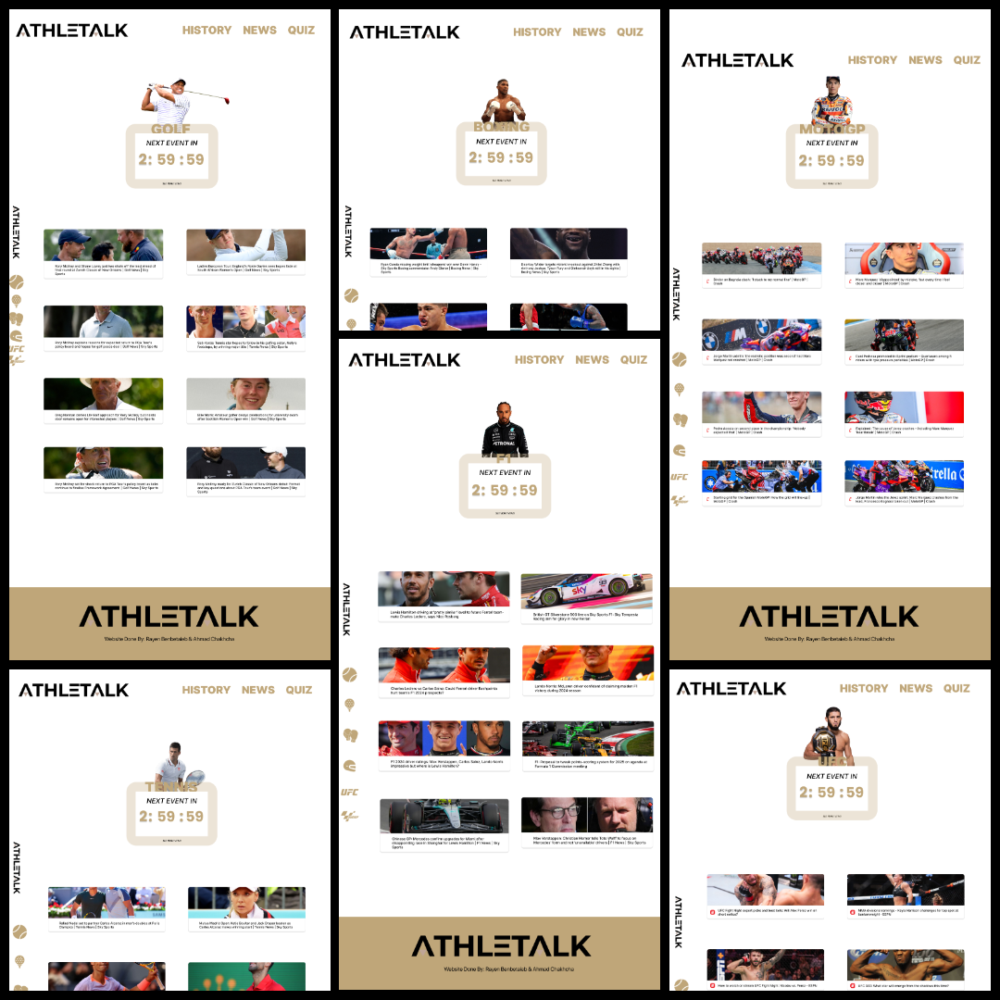
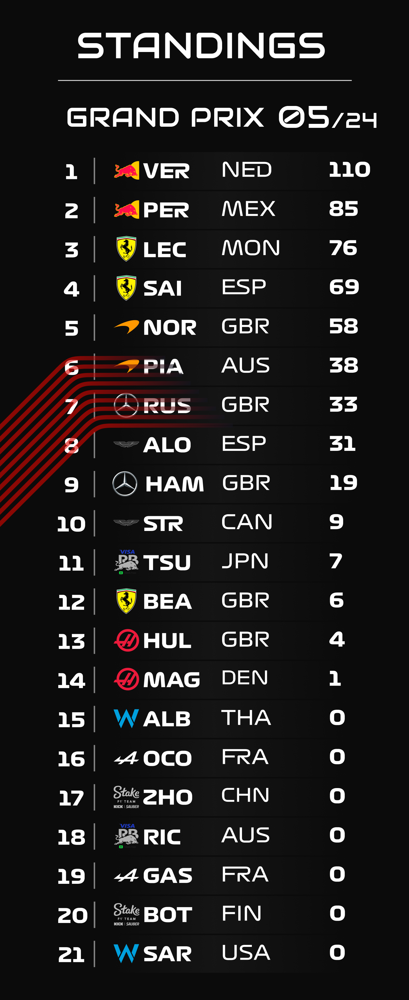

<h1 align="center"> ATHLETALK </h1>  

  

The Best Website To Get Individual Sports News.

## Table of Contents

- [Introduction](#introduction)
- [Features](#features)
- [Development Process](#development-process)
- [Technologies Used](#technologies-used)
- [Contributing](#contributing)
- [Development Team](#development-team)
- [Feedback](#feedback)
- [Contact](#contact)

## Introduction

Athletalk is a web-based platform dedicated to fans of individual sports, providing centralized access to key information, news, and updates about your favorite sports. Whether you follow Golf, Tennis, Boxing, UFC, MotoGP, or F1, Athletalk ensures you stay informed and engaged.

  

## Features

A few of the things you can do with GitPoint:
### 1. *User Authentification*
Sign up and sign in features for personalized user experiences, allowing users to access tailored content and save preferences.

  

### 2. *Dedicated Sport Pages*
- Each sport has its own page featuring the latest news, ensuring fans have access to up-to-date information.
- Countdown timers are available for every sport, displaying the time remaining until the next major event.

  

### 3. *History and Event Calendar*
- Explore the history of each sport and discover insights into its evolution.
- - Access comprehensive calendars for the current year, listing major events for each sport.
- **Note:** This feature is currently only available for Formula 1.

  

### 4. *Leaderboard*
- View athlete leaderboards for each sport, showcasing rankings and achievements.
**Note:** This feature is currently only available for Formula 1.

  

### 5. *Responsive Design*
- The website is designed to be fully responsive, offering a seamless experience on desktop, tablet, and mobile devices.

  

## Development Process
The website design was created entirely using **Figma**, utilizing its powerful design tools to craft an intuitive and visually appealing interface. The design was exported using the **Animaapp plugin** from Figma, and significant changes were made to ensure the website functions properly as a fully-fledged web application.
## Technologies Used
- HTML
- CSS
- JavaScript
- PHP
- **Design Tool**: Figma
## Contributing

Contributions are welcome! Feel free to suggest improvements, report issues, or add new features by contacting us or creating an issue on GitHub.

## Development Team

Athletalk was developed by [Rayen Benbetaieb](https://github.com/P0TER19) & [Ahmad Chakhcha](https://github.com/AhmadChakcha). We are passionate about combining technology and sports to create engaging digital experiences.
## Feedback

Feel free to send us feedback on X : [Rayen](https://x.com/RayenBettaeb1), [Ahmad](https://x.com/AhmadChakcha17) or [file an issue](https://github.com/P0TER19/ATHLETALK/issues/new). Feature requests are always welcome. 
## Contact

For any inquiries, feel free to contact us:
- Email: rayenbenbetaieb@gmail.com / ahmad.chakcha17@gmail.com 

---

Stay connected and never miss a moment with ATHLETALK!
